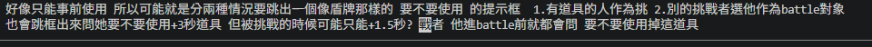

我需要一個按鈕。 按下這個按鈕後，我會跳轉到
"抽挑戰者" tab
裡面會有一個抽籤的輪盤 抽籤的 options，是現在當前所有有登入的 player，

抽到了一個人，它就會從輪盤中被移除 

直到所有 options 都被抽完，所有人就會再被放回選項中

這個畫面除了輪盤外，還有一個開始抽籤按鈕、移除陣亡者按鈕

抽籤按鈕按下去之後，會先跳出確定視窗，按下確定後才會執行轉盤

移除陣亡者按鈕會跳出一個 list，顯示所有當前還在輪盤中的玩家，可以選擇某位玩家，將它從整個初始玩家 list 中移除，( 不只是從當前的輪盤中移除 ) 這意味著當所有的 options 被抽光，要reset 回"所有玩家"時，被移除出初始玩家 list 的玩家不會再次出現在輪盤上

__
抽連勝獎勵頁面需要有 回 "主畫面" 按鈕，讓我可以回去 /dashbaord

/dashboard

開始對戰的畫面是占比90%的區塊，正下的空間有一個長方形的欄位可以在答對／跳過後顯示答案（由主持人操作），長方形的左上角和右上角分別有雙方對戰者的名字，並相應的顯示各自被投的票數。 右下角要有一個"下一題"按鈕，請不要給下一題按鈕加上任何的handler，先用placeholder，我之後再跟你描述如何handle click 的狀況。

___

___
我需要一個 interface 來裝我 "抽挑戰者" 的section 的結果。
{
challenger: 某個 player
}

抽完全域的這個 challenger，我會去"玩家狀態" section，點選某個玩家interface 底下的一個 theme。

按下去後，challnger 與這個被選中其主題的 player 就會1v1 battle，並且以這個被選中的 theme 作為 battle 主題 ( batttle 主題會影響"開始對戰'"section 裡渲染的內容。但請先將相關邏輯留空 )

___________
我的每個 player 初始化， 我要給這player一個名字，然後其四個theme之下都各有 35 ~ 50 張照片。  並且還沒用掉的 theme 就是它的 lives，所以不需要 lives變數
請用 stack 來儲存四個 theme。 
因為我預計主題就是玩家的 live，每當玩家輸了一次，請 pop 掉最上面的主題。 (先不要實作損失live的邏輯 我只是跟你解釋下我為啥需要 stack。)

______________
battle 後
被挑戰方如果勝利，被挑戰方第一個主題會變為 loser 的第一順位主題 。 而 loser 的第一順位主題則會被消耗掉 (給他一個 false boolean，並且玩家狀態 section 裡面渲染時，將 false 的theme渲染為灰色)

挑戰方如果勝利，挑戰方的第一個主題不會有變化，被挑戰方(輸了)的第一主題就會被消耗掉(一樣給他一個flase boolean .... 同上)

____________

當挑戰者是 A，的時候。 dashboard 那裏的"玩家狀態" 應該要暫時隱藏 A 的主題card

第四個主題一開始就應該要是 false，(初始命數是3) 要完成跟主持人的挑戰賽 (挑戰者挑戰主持人，並且勝利。 它才能把自己的這主題加入自己的生命池 )

_______
在對決的時候，vote畫面不會同步到battle中的那兩個人。這樣就沒辦法投票賭對決的人誰會贏

下次新session直接說繼續 vote Sync ，就從task 4接著做
___
先確定開始計時了，再換出圖片。現在好像先換圖片 然後延遲一下才開始倒計時?
___
抽連勝獎勵的按鈕 感覺可以移動到 挑戰主持人 那邊

__
開始 battle 文字可以刪掉。把騰出來的空間，都撥給照片區，讓照片可以上下再大一點。 
然後玩家票數的部分應該要獨立於照片、計時器區域，移動到畫面左邊，變成一個垂直的條，以條的長度顯示票數的累積

__

不能同時持有兩個連勝道具 但原本似乎預期要可以 但不用掉也比較怪? 盾牌硬要用也很怪?

啟用第四主題之後，現在當前能挑戰的最上面的主題要是誰? 還沒確定 行為也詭異

+3秒

一個人抽完連勝獎勵後，他抽到的結果，會一直存在於抽連勝獎勵的選單畫面上。但其實他抽完之後這個事件就結束了，跟其他人又再要去抽、發生其他的事情沒關係，所以抽的結果一直留在畫面上會挺干擾 frontend design

抽連勝獎勵的環節，抽的過程本身沒啥儀式感。可以考慮抽到之後(道具顯示在卡片上)，播放一個"道具出現、進入玩家狀態卡片" 的銜接動畫，加強 我拿到東西了 的感覺 frontend design

被挑戰的時候就要+3秒? 挑戰的時候預先開? 按下道具的時機到底是何時呢

或者就都不要盾牌了 只有+3秒

同一位玩家如果連續點擊兩次跳過（兩道題目被跳過），會在進入第三題的時候自動把答題權轉讓給另一位玩家。 等於連續按跳過的情況 第一次的處罰比較重 (扣3秒 + 還是得繼續答題) 第二次處罰比較輕 (扣3秒，但換成對方要答題，開始損耗對方的秒數了)

現在連贏兩場會有 +3秒的道具。 想再新增 如果連贏四場 會有 +7秒的道具；如果把另一個玩家的最後一條命給贏走 ( 淘汰一個玩家) 會獲得 +5秒的道具

## 這裡以下還沒做 

想稍微修改 選擇挑戰對象那邊的 card ui，就是如果是挑戰者 那卡片就保留上面的挑戰者顯示就好 不用顯示他的題目了。  或者只顯示他的第一主題就好

剩下的題目數量剩餘 7 的時候，希望畫面上有UI提示 慢慢在倒數題數 因為題目結束的時候比賽就結束，會以剩餘秒數結算，玩家會需要知道這種結算方式即將發生 以配置好自己的策略 

投票10秒  投票成功結算畫面 要有顯示投對次數的變數+渲染  投對五次 

續命題再打的時候 沒有要投票

___
login畫面的 玩家狀態 寫命數*4 但這是錯的 一開始就只有3。因為代表命數主題雖然有四個 但其中一個一開始是鎖住的 要達續命題才能解鎖 解鎖後命數才會+1

dashbaord 這邊也有一樣的問題   

現在只改UI會filter掉尚未啟動的主題 但看起來後端變數實際上也沒有正確註冊好 : 一開始第四個主題是 not activated(或不知道怎麼稱呼 你可以先探索現在程式碼邏輯˙來確認) ，需要玩贏得續命題才能解嗩那主題

玩家主題的順序在 tab 分支的玩家狀態頁那邊顯示的是反的

搜尋: 
state.value.challengerTimer = 